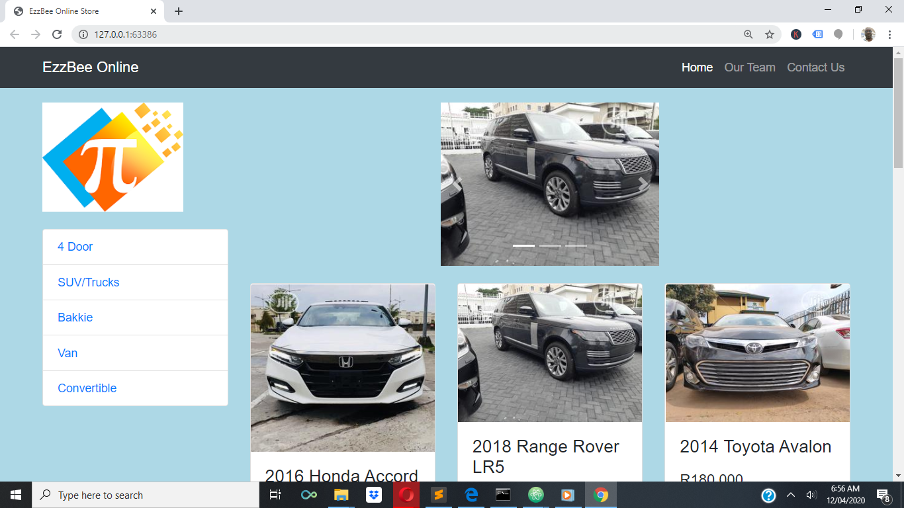
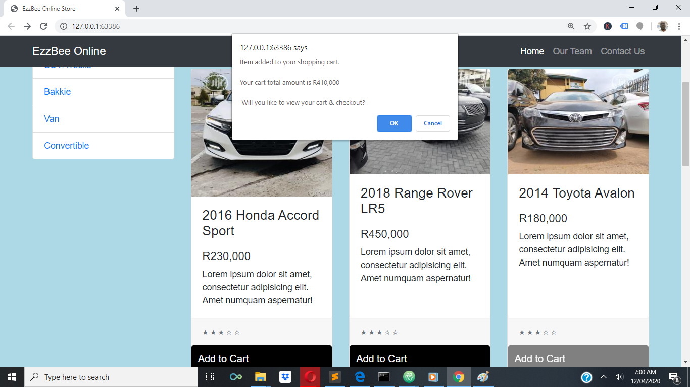
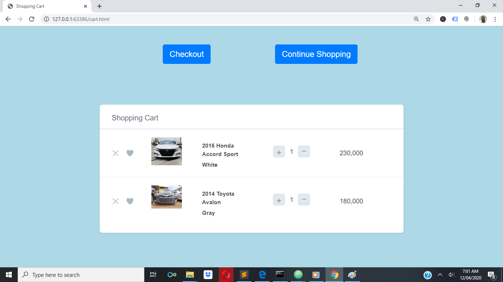

# EzzBee Online Auto Store
This is an online auto sale store. This online store is a full-fledge ecommerce website where visitors get to browse the 
entire catalogue of vehicles on sales, filter the inventory by the type of vehicles, add to their shopping cart and, at the end
of their shopping, checkout. 

The checkout process involves capturing the personal details of the customer, as well as their shipping and payment options.
Shipping can either be Door-to-door delivery or pick up at a designated location while all the major payment systems are supported.

In its current state, some of the functionalities are yet to be coded. These include the payment options, ability to increase or decrease 
quantity being ordered from the Checkout page. The database backend is also not in place.

## Installation
This app, being web-based does not require any special installation steps. Simply point your web browser to the its home page url and you're good to go.

## Usage
From the home page, shown below, the other parts of the website can be accessed.

The catalogue can be filtered to show only specifical type of vehicles, using the **Side Bar**. These types are **4-DOOR, SUV, BAKKIE, VAN** and **COVERTIBLES**

To add a vehicle to the cart, click on the **ADD TO CART** button, the system then displays the prompt box below, to confirm the addition of the vehicle as well as the total amount of the all the vehicles currently in the cart.

If you click on the **Cancel** prompt, you are returned to the cataloge to continue shopping. Otherwise, you are taken to the shopping cart as shown below.

